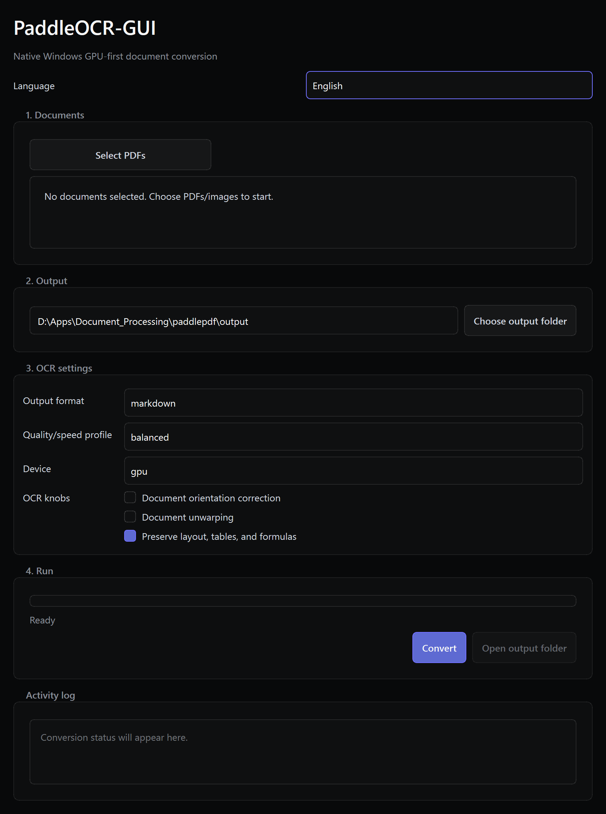

# PaddleOCR-GUI

PaddleOCR-GUI is a Python desktop app and CLI for converting PDFs and common document images with the SOTA PaddleOCR-VL-1.6 document parsing pipeline.

It uses `PaddleOCRVL(pipeline_version="v1.6")` natively by default. On Windows, the default setup installs the CUDA 12.9 PaddlePaddle GPU runtime and the app requests `gpu:0` first; if CUDA is not available, reports include a warning that CPU is being used. Model weights are not included in this repo; PaddleOCR downloads and caches the official files on first use.



## Install UV

Windows PowerShell:

```powershell
powershell -ExecutionPolicy ByPass -c "irm https://astral.sh/uv/install.ps1 | iex"
```

macOS/Linux:

```bash
curl -LsSf https://astral.sh/uv/install.sh | sh
```

## Setup: client app

```bash
uv sync --dev --extra ocr --extra gpu
```

This installs the client app, PaddleOCR document parser, and CUDA 12.9 PaddlePaddle GPU runtime by default. The project uses UV's `[tool.uv.sources]` configuration so normal Python packages resolve from PyPI and only `paddlepaddle-gpu` resolves from PaddlePaddle's official CUDA 12.9 wheel index.

Windows PowerShell users can run:

```powershell
.\setup.ps1
```

macOS/Linux users can run:

```bash
chmod +x setup.sh run_gui.sh
./setup.sh
```

## Native GPU-first runtime

PaddleOCR-GUI runs PaddleOCR-VL in-process by default. The GUI, CLI, and MCP all use the same converter, so a normal conversion needs no Docker container and no GenAI server URL.

The default device is `gpu`. When PaddlePaddle CUDA is available, the app passes `gpu:0` to PaddleOCR-VL. When CUDA is unavailable or CPU is selected, the JSON report and GUI log include a warning such as `GPU was requested but PaddlePaddle CUDA is unavailable; using CPU.`

Use an external PaddleOCR-VL GenAI server only when you intentionally want a separate local or remote server. For CLI/MCP, pass `--vl-server-url` or `vl_server_url`, or set `PADDLEOCR_VL_SERVER_URL`.

Official PaddleOCR server commands use one of these backends:

```bash
paddleocr genai_server --model_name PaddleOCR-VL-1.6-0.9B --backend vllm --port 8118
paddleocr genai_server --model_name PaddleOCR-VL-1.6-0.9B --backend sglang --port 8118
paddleocr genai_server --model_name PaddleOCR-VL-1.6-0.9B --backend fastdeploy --port 8118
```

For CLI/MCP, configure the client with either:

```bash
export PADDLEOCR_VL_SERVER_URL=http://localhost:8118/v1
```

or pass `--vl-server-url http://localhost:8118/v1` to the CLI/MCP call. On Windows PowerShell:

```powershell
$env:PADDLEOCR_VL_SERVER_URL = "http://localhost:8118/v1"
```

The server machine should be configured according to PaddleOCR's hardware/backend guide.

Validated Docker GPU server path:

```bash
docker run --rm --name paddleocr-vl-server --gpus all --shm-size 8g -p 8118:8118 \
  ccr-2vdh3abv-pub.cnc.bj.baidubce.com/paddlepaddle/paddleocr-genai-vllm-server:latest-nvidia-gpu \
  paddleocr genai_server --model_name PaddleOCR-VL-1.6-0.9B --host 0.0.0.0 --port 8118 --backend vllm
```

Use `http://127.0.0.1:8118/v1` from the client after the container health endpoint is ready.

## Optional CPU-only setup

Use this only when the machine should not install CUDA PaddlePaddle libraries. CPU conversion works, but GPU is preferred for practical local OCR throughput.

```bash
uv sync --dev --extra ocr --extra cpu
```

Windows PowerShell users can run `./setup_cpu.ps1`. macOS/Linux users can run `./setup_cpu.sh`.

Do not install CPU and GPU PaddlePaddle packages together. UV marks these extras as conflicting.

## Other GPU versions

CUDA 12.9 is the default pinned GPU path. CUDA 12.6 from the PaddleOCR-VL model card can be installed manually if your environment requires it:

```bash
uv pip uninstall paddlepaddle-gpu
uv pip install paddlepaddle-gpu==3.2.1 -i https://www.paddlepaddle.org.cn/packages/stable/cu126/
```

For Apple Silicon or other accelerators, follow the official PaddleOCR-VL hardware guide first, then run this app in that environment.

## Run the GUI

```bash
uv run paddlepdf-gui
```

Windows PowerShell:

```powershell
.\run_gui.ps1
```

macOS/Linux:

```bash
./run_gui.sh
```

The GUI lets users select PDFs or images, choose an output folder, choose Markdown/JSON/text/all, set the device and OCR knobs, watch progress, and open the output folder when conversion completes. Conversion runs in a worker thread so the window stays responsive. The interface auto-detects the OS language and can be switched manually between English, Spanish, Korean, Chinese, Japanese, Hebrew, and Arabic.

## Run the CLI

```bash
uv run paddlepdf convert input1.pdf input2.pdf --out ./output --format markdown
```

Useful options:

```bash
uv run paddlepdf convert paper.pdf --out ./output --format all --device gpu
uv run paddlepdf convert paper.pdf --out ./output --format text --plain-flow
uv run paddlepdf convert scan.png --out ./output --format markdown
uv run paddlepdf convert paper.pdf --out ./output --dry-run
uv run paddlepdf convert paper.pdf --out ./output --format markdown --vl-server-url http://localhost:8118/v1
```

Supported inputs: `.pdf`, `.png`, `.jpg`, `.jpeg`, `.tif`, `.tiff`, `.bmp`, and `.webp`.

Outputs are written into predictable per-document folders under the selected output folder. PDF names are sanitized and duplicate stems become `name`, `name-2`, and so on.

## Agent usage

Setup:

```bash
uv sync --dev --extra ocr --extra gpu
```

MCP server command:

```bash
uv run paddlepdf-mcp
```

The MCP server exposes `convert_documents` with these top-level arguments:

- `input_files`: PDF/image paths
- `output_dir`: output folder
- `output_format`: `markdown`, `json`, `text`, or `all`
- `vl_server_url`: optional PaddleOCR-VL GenAI `/v1` endpoint override
- `dry_run`: validate paths and planned outputs without OCR

The MCP tool returns the same structured report shape as CLI `--agent` output.

Command:

```bash
uv run paddlepdf convert input1.pdf input2.pdf --out ./output --format markdown --agent
```

Windows executable bundle command:

```powershell
.\PaddleOCR-GUI-CLI.exe convert input.pdf --out output --format markdown --agent
```

Any distribution of this project, including future Docker images, must keep a CLI entry point with the same `convert ... --agent` JSON contract so coding agents can process PDFs and images without GUI automation.

Dry-run command that does not load PaddleOCR:

```bash
uv run paddlepdf convert input.pdf --out ./output --format all --dry-run --agent
```

`--agent` prints deterministic JSON to stdout with:

- `status`
- `input_files`
- `output_files`
- `warnings`
- `errors`
- `elapsed_seconds`
- per-document status details

`output_files` includes requested Markdown/JSON/text artifacts and any generated sidecar assets such as extracted figures or page images. Agents should keep those paths with the Markdown because PaddleOCR-VL may reference sidecar image files from the generated content.

Exit code is `0` for success and nonzero for failed or partial runs.

## Package a zip

For a Windows executable bundle similar to apps that ship their DLLs beside the `.exe`, run:

```powershell
.\package_windows.ps1
```

This builds `dist\PaddleOCR-GUI\PaddleOCR-GUI.exe` and `dist\PaddleOCR-GUI\PaddleOCR-GUI-CLI.exe` with PyInstaller's one-folder layout and writes `dist\PaddleOCR-GUI-windows-x64.zip`. The folder is intentionally distributed as a directory-style app bundle so the executables can load the collected Qt, PaddlePaddle, CUDA, and NVIDIA DLL/resource files next to them.

The GUI executable runs native PaddleOCR-VL by default. The CLI executable remains the agent surface; pass `--vl-server-url` or set `PADDLEOCR_VL_SERVER_URL` only when intentionally using a separate PaddleOCR-VL GenAI server.

Source-only zip commands:

Windows PowerShell:

```powershell
Compress-Archive -Path pyproject.toml,README.md,setup.ps1,setup.sh,setup_cpu.ps1,setup_cpu.sh,run_gui.ps1,run_gui.sh,src,tests,typings -DestinationPath paddlepdf.zip -Force
```

macOS/Linux:

```bash
zip -r paddlepdf.zip pyproject.toml README.md setup.ps1 setup.sh setup_cpu.ps1 setup_cpu.sh run_gui.ps1 run_gui.sh src tests typings
```

Do not include `.venv`, model caches, or downloaded PaddleOCR weights in the zip.

## Troubleshooting

- First conversion is slow because PaddleOCR downloads model files and initializes PaddleOCR-VL.
- PaddleOCR downloads official models from Hugging Face by default. PaddleOCR-GUI disables PaddleOCR's pre-download hoster health check to avoid false negatives; set `PADDLE_PDX_MODEL_SOURCE=BOS` only if Hugging Face is inaccessible on your network.
- If `paddleocr is not installed`, run `uv sync --dev --extra ocr --extra gpu`.
- If PaddlePaddle import fails, install exactly one runtime package: CPU `paddlepaddle` or GPU `paddlepaddle-gpu`.
- If the report warns that GPU is unavailable, confirm `paddlepaddle-gpu` is installed, the NVIDIA driver is working, and `paddle.device.cuda.device_count()` is greater than zero.
- If `PaddleOCR-VL server unavailable` appears, you explicitly configured `--vl-server-url` or `PADDLEOCR_VL_SERVER_URL`; confirm the GenAI server is healthy or remove the override to use native OCR.
- If GPU runs out of memory, use a smaller workload, switch to a larger GPU machine, or intentionally target a remote GenAI server.
- If macOS PaddlePaddle wheels are unavailable for your machine, use the official PaddleOCR-VL Docker or hardware-specific guide.
